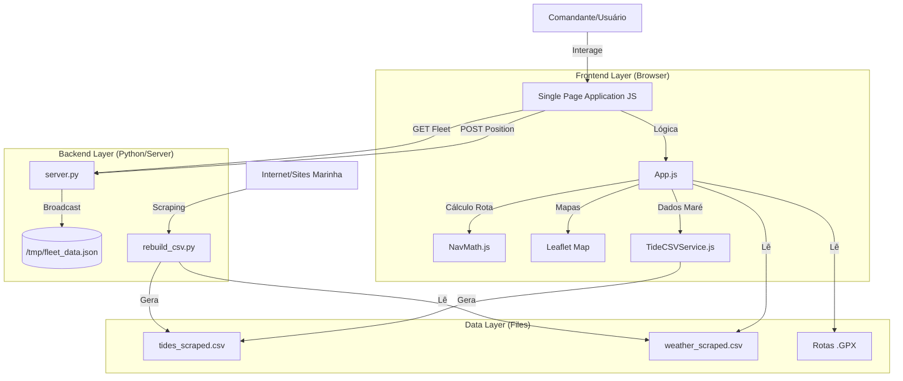

# 02 - Arquitetura e Design: SISNAV Costeiro v3.0

## 1. Visão Geral da Arquitetura
O SISNAV Costeiro adota uma **Arquitetura Híbrida** (Client-Side Heavy), onde a maior parte da lógica de negócio reside no navegador do usuário (JavaScript), garantindo operação offline. O Backend (Python) atua em dois momentos distintos:
1.  **Pré-Processamento (Offline/Batch):** Coleta e formatação de dados ambientais.
2.  **Serviços Online (Real-Time):** API leve para sincronização de frota.

---

## 2. Componentes Principais

### 2.1. Frontend (O Núcleo)
A aplicação é construída sem frameworks pesados (No-Build step), utilizando **ES6 Modules** nativos.
*   **`App.js`**: O "Maestro". Inicializa o sistema, gerencia abas (Appraisal/Plan/Monitor) e coordena os módulos.
*   **`State.js`**: Um Singleton que armazena o estado global da viagem (Portos selecionados, Navio atual, Rota calculada), garantindo que dados não se percam ao trocar de aba.
*   **`MapService.js`**: Encapsula o Leaflet.js. Responsável por desenhar linhas, ícones de navios e lidar com camadas de cartas náuticas.

### 2.2. Backend de Dados (Data Pipeline)
Scripts Python que rodam periodicamente (Cron) ou sob demanda.
*   **`rebuild_csv.py`**: Orquestrador. Chama os scrapers para todos os portos configurados.
*   **`scraping_tide.py`**: Conecta-se a fontes externas (Tábua de Marés), faz o parse do HTML e normaliza os dados.
*   **Robustez**: Se o site externo mudar, apenas este script precisa ser atualizado, sem afetar o resto do sistema.

### 2.3. Backend de Frota (API Real-Time)
Um micro-serviço Flask (`server.py`) focado em performance e simplicidade.
*   **Endpoint `/api/position`**: Recebe `POST` com lat/lon/speed do navio.
*   **Endpoint `/api/fleet`**: Retorna JSON com a lista de todos os navios ativos nas últimas 24h.
*   **Persistência**: Grava em arquivo JSON local (`/tmp/sisnav_fleet_data.json`) para sobreviver a reciclagens de processo do servidor web (Passenger/WSGI).

---

## 3. Decisões de Design

*   **HTML5 Semantic + TailwindCSS**: Garante acessibilidade e facilidade de manutenção visual sem escrever CSS complexo.
*   **CSV como Banco de Dados**: A escolha por CSV e JSON estático elimina a necessidade de um servidor SQL, tornando a implantação trivial (basta copiar arquivos) e a leitura no Javascript extremamente rápida.
*   **Offline-First**: Toda a lógica crítica (cálculo de ETA, maré, visualização de carta) roda localmente. A dependência de internet é estritamente opcional.
