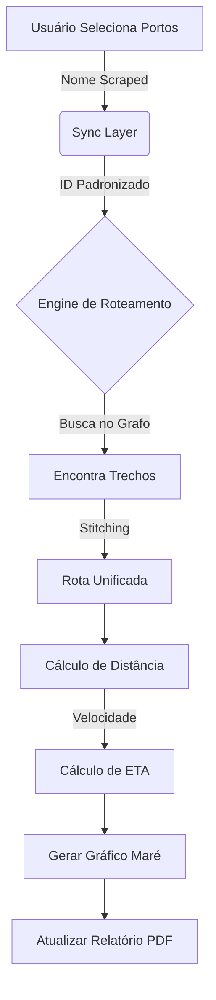

# Estratégia de Roteamento Implementada - SISNAV Costeiro v3.0

## 1. Arquitetura de Roteamento Baseada em Grafo

O sistema implementou uma engine de roteamento moderna baseada em teoria dos grafos, onde:
*   **Nós (Nodes)** = Portos Cadastrados (PortDatabase.js e TideCSVStation)
*   **Arestas (Edges)** = Trechos de rotas conhecidas (known_routes.json)

### 1.1 Algoritmo de Busca (BFS)
Ao selecionar ORIGEM e DESTINO, o sistema executa uma Busca em Largura (BFS - Breadth-First Search) no grafo de rotas:
1.  **Identificação**: Mapeia o porto de saída e chegada para os nós mais próximos.
2.  **Busca**: Explora todas as conexões possíveis.
3.  **Costura (Stitching)**: Se não houver rota direta, conecta múltiplos segmentos (Ex: Rota A + Rota B).
4.  **Inversão**: Capaz de usar rotas no sentido inverso (Invertendo a ordem dos Waypoints) se necessário.

---

## 2. Camada de Sincronização (Sync Layer)

Um desafio crítico resolvido foi a integração entre dados de fontes distintas:
*   **Barra Lateral (UI)**: Usa nomes de portos vindos do Web Scraping de Marés (ex: "Rio Grande").
*   **Engine de Roteamento**: Usa IDs internos padronizados (ex: "BR_RIG").

### Solução: Translation Middleware
Implementado em `App.js`, um middleware intercepta a seleção do usuário na barra lateral:
1.  Recebe o nome "Rio Grande".
2.  Consulta o `PortDatabase` para encontrar o ID correspondente ("BR_RIG").
3.  Injeta o ID no motor de roteamento, disparando o cálculo automático.

---

## 3. Integração com Maré e ETA

O roteamento não é apenas geométrico, mas temporal:
1.  **Trigger**: Assim que uma rota válida é encontrada (`autoFindRoute`), o evento dispara `recalculateVoyage`.
2.  **Cálculo**:
    *   Distância Total (somatório das pernas loxodrômicas).
    *   Tempo de Viagem = Distância / Velocidade da Embarcação.
    *   ETA = ETD + Tempo de Viagem.
3.  **Análise de Maré**: Com o ETA calculado, o sistema consulta a base de marés (`tides_scraped.csv`) para gerar os gráficos de +/- 3h para a chegada.

---

## 4. Modos de Operação

| Modo | Descrição | Status |
| :--- | :--- | :--- |
| **Automático** | Connecta portos via grafo. Ideal para rotas padrão. | ✅ Implementado |
| **Manual (GPX)** | Importa arquivo externo. Para rotas novas/atípicas. | ✅ Implementado |
| **Manual (Click)** | Plotagem ponto a ponto no mapa. | ✅ Implementado |
| **Híbrido** | Edição manual sobre uma rota automática. | ✅ Implementado |

---

## 5. Fluxo de Dados (Pipeline)

